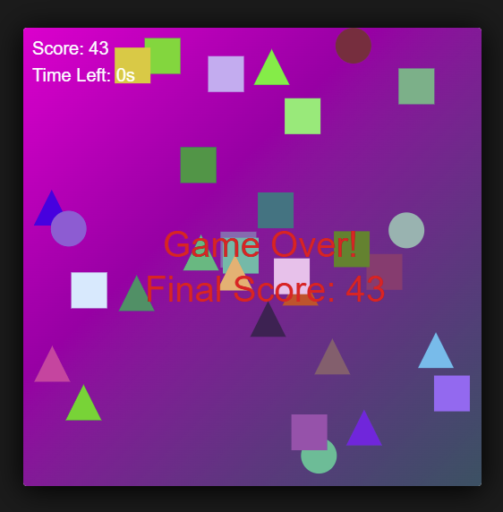

# Design Pattern Game

## About the Game
This is a simple game made using **TypeScript** and **HTML5 Canvas**. The game has moving shapes (**circles, squares, and triangles**) that the player can interact with by clicking. The goal is to earn points by clicking on shapes while they move around.

## Features
- Shapes move randomly on the screen.
- Click a shape to remove it and earn points.
- Click on an empty space to add new shapes.
- Shapes get faster every **30 seconds**.
- The game runs for **2 minutes** before ending.

## Design Patterns Used
This game follows several the software design patterns:

### 1. Creational Patterns (Making Objects)
- **Singleton Pattern**: Ensures the game has only one instance running (`Game.ts`).
- **Factory-Like Pattern**: Randomly creates a shape (`CircleEntity`, `SquareEntity`, `TriangleEntity`) dynamically (`Game.ts`).

### 2. Structural Patterns (Organizing Code)
- **Facade Pattern**: `Game.ts` handles the main game logic, while smaller files (`Loop.ts`, `Mouse.ts`, `Entity.ts`) handle specific tasks like animation and input.
- **Composite Pattern**: Stores multiple shapes in an array and treats them as one unit for updating and drawing.

### 3. Behavioral Patterns (How Objects Behave)
- **Template Method Pattern**: The game follows an update-and-draw cycle every frame (`Game.ts`, `Loop.ts`, `Entity.ts`).
- **Observer Pattern**: `Mouse.ts` detects mouse clicks and **notifies `Game.ts`** when an interaction happens.

## Technology Used
- **TypeScript**: Provides better coding structure.
- **HTML5 Canvas API**: Used for rendering graphics.
- **RequireJS**: Helps manage script files.
- **CSS**: Used for simple game styling.

## How to Play
1. Open `index.html` in a web browser.
2. Click on shapes to remove them and earn points.
3. Click on an empty area to add new shapes.
4. Shapes move faster as time passes!
5. Try to get the **highest score** before time runs out!

## How to Run the Game
1. **Download or clone** the repository.
2. Open the project folder.
3. Double-click `index.html` to open it in a browser.

## Who Made This?
I worked on this project **alone** as a way to learn about **design patterns** through this simple game.

## License
This project is free to use under the **MIT License**.
